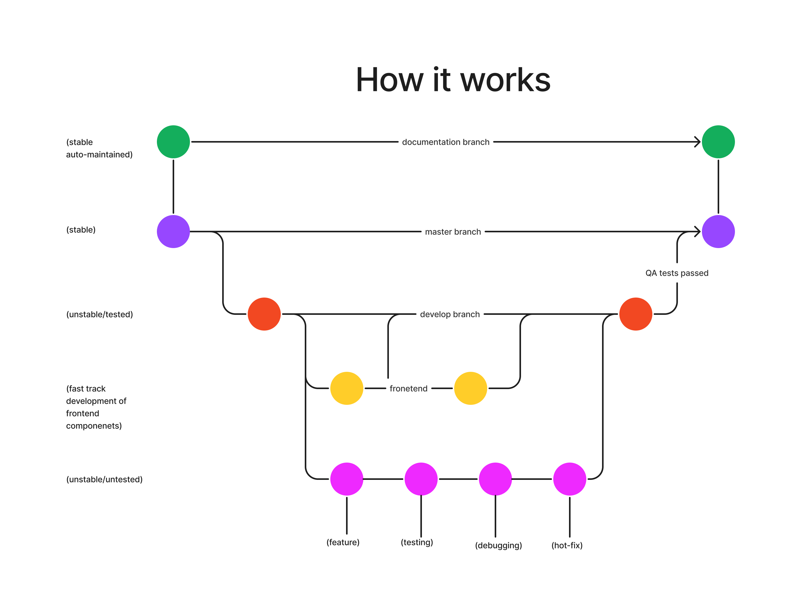

# How to contribute to this project

1. If you have not already, create a new branch in this repository(You can name it whatever you like).
2. Clone your branch onto your local machine where you will do development and testing.
3. As you make changes to your clone, you can push and pull to your branch that you created.
4. When you are satisfied that the feature you wanted to add works, all of the code compiles and all of the various tests have passed, create a pull request and you may ask other members to review your pull request and maybe test your new feature on their local machine's then merge your branch to the develop branch, or you may just go right ahead and merge to the develop branch.
5. If you want to add a new feature again, just sync your current branch that you created with the develop branch, make a git pull onto your local machine for your branch and repeat from step 3.
6. Don't forget to add yourself as a contributor to the README.md file in the contributors table. To do that, edit that file and scroll to the bottom, and just below the most recently added contributor, add this: ```| " alt="profile" width="100" height="100"/> | <your username goes here> | <a href="<your website link goes here>"><your website name goes here></a> | <your role in this project goes here> | <your bio goes here> |``` and replace the appropriate fields.
7. NB: Merging to main should only happen when we are confident in the stability of our code.

# Visual representation of how it works


