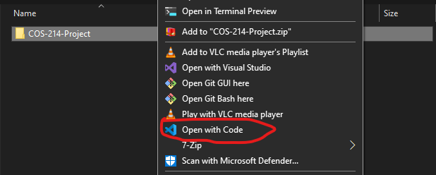
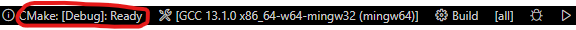

# COS-214-Project


## Table of Contents

- [COS-214-Project](#cos-214-project)
  - [Table of Contents](#table-of-contents)
  - [Summary](#summary)
  - [Contributing](#contributing)
  - [Building](#building)
    - [Building with visual studio code](#building-with-visual-studio-code)
    - [Building from the command line with windows OS](#building-from-the-command-line-with-windows-os)
    - [Building from the command line with a Linux based OS(Debian, Ubuntu and Fedora) automatically](#building-from-the-command-line-with-a-linux-based-osdebian-ubuntu-and-fedora-automatically)
    - [Building from the command line with a Linux based OS(Debian, Ubuntu and Fedora) manually](#building-from-the-command-line-with-a-linux-based-osdebian-ubuntu-and-fedora-manually)
  - [Contributors](#contributors)

## Summary
A restaurant simulation application that makes use of various design patterns.
implemented in C++ with a ReactJS frontend.

## Contributing
Please have a look at <a href="https://github.com/waveyboym/COS-214-Project/blob/main/CONTRIBUTING.md">CONTRIBUTING.md</a> for more details on contributing to this repo

## Building
### Building with visual studio code
1. Download and install C++ build tools by following this <a href="https://github.com/bycloudai/InstallVSBuildToolsWindows">tutorial</a>
2. Download and install <a href="">boost</a> for your operating system.
3. Download and install <a href="https://cmake.org/download/#latest">cmake</a>
4. Clone this repo
5. Download and install <a href="https://code.visualstudio.com/">visual studio code</a>
6. Download and install <a href="https://marketplace.visualstudio.com/items?itemName=ms-vscode.cmake-tools">cmake tools</a> from the visual studio marketplace
7. Add the folder ```COS-214-Project``` to a new work space in visual studio or open with code from your file manager. 
8. Wait for VS code to initialize and set itself up(it may add some files under the build folder)
9.  At the bottom of Visual Studio code, you should see a play button, click it and the project should build and run. 
10. Specify the build type(Release or Debug) by clicking and changing it. 
11. If you are in debug, skip steps 12 to 14
12. Then open another terminal and from the root of this project run
```
cd COS-214-PROJECT/src/frontend
```
13.  Run
```
npm install
```
14.  Run
```
npm run dev
```
15. For a more detailed tutorial on cmake, follow this <a href="https://cmake.org/cmake/help/latest/guide/tutorial/index.html">link</a>
16. Alternative tutorials: 
    * https://code.visualstudio.com/docs/cpp/cmake-linux
    * https://www.youtube.com/watch?v=sc6_86jgQls&ab_channel=TechHara

### Building from the command line with windows OS
1. Download and install <a href="https://cmake.org/download/#latest">cmake</a>
2. Follow <a href="https://www.geeksforgeeks.org/how-to-install-c-boost-libraries-on-windows/">this guide</a> to download and install boost
3. Clone this repo
4. Open a new terminal where you cloned this repo to and run 
```
cd COS-214-PROJECT/src
```
5. For Release(no unit tests, with gui), run
```
cmake -DCMAKE_BUILD_TYPE=Release -S . -B build
```
6. For Debug(google unit tests, with no gui), run
```
cmake -DCMAKE_BUILD_TYPE=Debug -S . -B build
```
7. Run 
```
cmake --build build
```
8. For Release(no unit tests, with gui), run
```
cd build && ./main
```
9. For Debug(google unit tests, with no gui), run
```
cd build && ctest
```
10. If you are in debug, skip steps 11 to 13
11. Then open another terminal and from the root of this project run
```
cd COS-214-PROJECT/src/frontend
```
12.  Run
```
npm install
```
13.  Run
```
npm run dev
```
14. If any build files are generated on your local machine, please do not commit them. Rather create a ```.gitignore``` file in the build directory and add an asterik(*) to it.
15. For a more detailed tutorial on cmake, follow this <a href="https://cmake.org/cmake/help/latest/guide/tutorial/index.html">link</a>

### Building from the command line with a Linux based OS(Debian, Ubuntu and Fedora) automatically
1. Open a new terminal
2. Download <a href="">this</a> bash file
3. Run the bash script in your terminal and watch the magic happen ✨
4. Then open another terminal and from the root of this project run
```
cd COS-214-PROJECT/src/frontend
```
5. Run
```
npm install
```
6. Run
```
npm run dev
```

### Building from the command line with a Linux based OS(Debian, Ubuntu and Fedora) manually
1. Open a new terminal
2. Run 
```
sudo apt-get install libgtest-dev
```
3. Run 
```
sudo apt-get install cmake
```
4. Follow <a href="https://www.geeksforgeeks.org/how-to-install-boost-library-in-cpp-on-linux/">this guide</a> to download and install boost
5. Clone this repo
6. Open a new terminal where you cloned this repo to and run 
```
cd COS-214-PROJECT/src
```
7. For Release(no unit tests, with gui), run
```
cmake -DCMAKE_BUILD_TYPE=Release -S . -B build
```
8. For Debug(google unit tests, with no gui), run
```
cmake -DCMAKE_BUILD_TYPE=Debug -S . -B build
```
8. Run 
```
cmake --build build
```
9. For Release(no unit tests, with gui), run
```
cd build && ./main
```
10. For Debug(google unit tests, with no gui), run
```
cd build && ctest
```
11. If you are in debug, skip steps 12 to 14
12. Then open another terminal and from the root of this project run
```
cd COS-214-PROJECT/src/frontend
```
13. Run
```
npm install
```
14. Run
```
npm run dev
```
15.  If any build files are generated on your local machine, please do not commit them. Rather create a ```.gitignore``` file in the build directory and add an asterik(*) to it.
16.  For a more detailed tutorial on cmake, follow this <a href="https://cmake.org/cmake/help/latest/guide/tutorial/index.html">link</a>

## Contributors

Thanks to these wonderful people for their contributions.

| Profile      | Username | Personal Website | Role | Bio |
| ----------- | ----------- | ----------- | ----------- | ----------- |
|  | Michael | <a href="https://waveyboym.github.io/">waveyboym</a> | Tech Lead, Software developer, Software architect  | interested in computer science and creating fun CS related projects |
|  | Carey | <a href="https://github.com/u21631532">cmokou</a> | Software developer, UI/UX Engineer, Business analyst | - |
|  | Lunga | <a href="https://github.com/Remiku-bit">Remiku-bit</a> | Engineering Manager, Software developer | - |
|  | Jaden | <a href="https://github.com/u22528492">Jaden Moodley</a> | Software developer, QA engineer, Tester| - |
|  | Jaide | <a href="https://github.com/JMPastoll">JMPastoll</a> | Software developer | - |
|  | Linda | <a href="https://github.com/LOK3LANI">LOK3LANI</a> | Software developer, QA engineer, Tester | - |
|  | Nicholas | <a href="https://github.com/NicholasJHarvey">NicholasJHarvey</a> | Software developer, Tester, QA engineer | - |
